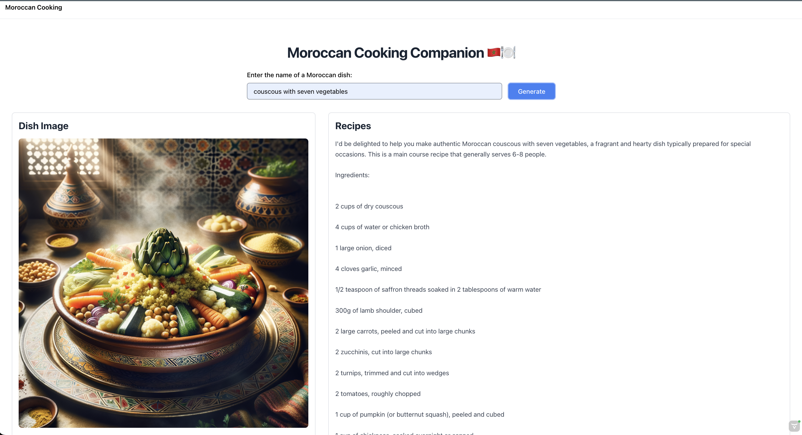

## Moroccan Cooking Companion 🇲🇦🍽️

> A web application that allows users to search for traditional Moroccan dishes and retrieve their recipes along with mouthwatering images. Built with Spring Boot, Spring AI, and Hilla from Vaadin for a seamless and user-friendly experience.

💡 This project is focused on learning and experimenting with the [Spring AI 🍃](https://github.com/spring-projects/spring-ai) and [Vaadin's Hilla ⚛️](https://hilla.dev/) technologies. It's not aimed at building a business application but rather serves as a playground to explore the capabilities of these innovative frameworks and gain hands-on experience with AI engineering and seamless Spring Boot-React integration.

🌀 This Application is `in-progress` and I will add new features over time.

## Application Screenshot

## Features

- ✅ Search for traditional Moroccan dishes
- ✅ Get the recipes with image

## Tech Stack

- **[`🍃️ Spring Boot`](https://spring.io/projects/spring-boot)**
- **[`🤖️ Spring AI`](https://spring.io/projects/spring-ai)**
- **[`🌐️ Vaadin's Hilla`](https://hilla.dev/)**
- **[`📦️ Maven`](https://maven.apache.org/)**

## Support

- ⭐️️ Star this repository if you find it useful.
- 🐛️ If you find a bug, raise an issue or fix it and send a pull request.
- 📢️ If you have any feature requests, raise an issue or send a pull request.
- 🤲 If you have a moment, don't forget to make a duaa for me and my parents.
